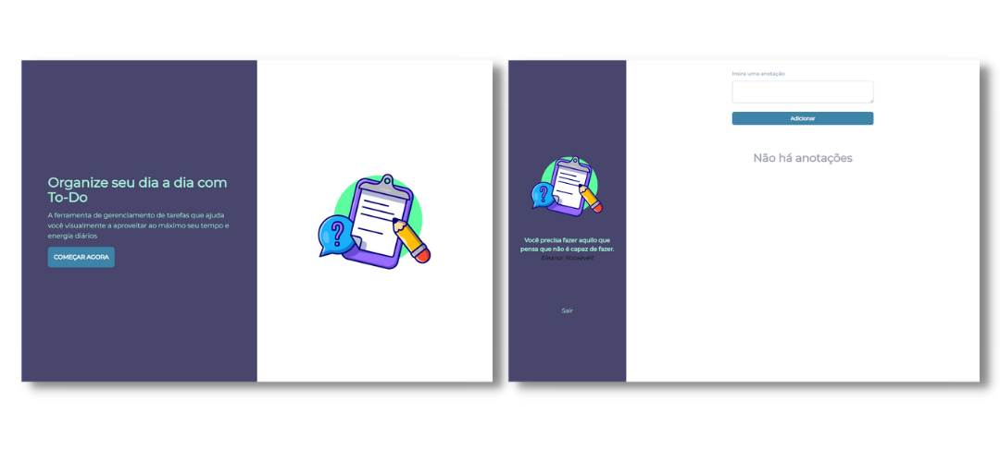

# To Do List - React JS

<div align="center">

  ## 🛠️ Projeto em Andamento

</div>

## Preview das telas do projeto

<div align="center">
  
</div>

## Requisitos do Projeto:

- Aplicar o Clean Code (Obrigatório) ✔️
- React JS ✔️
- Framework de estilo ✔️
- Paginação de dados nas telas de consultas
- Autorizar TODAS as requisições via token JWT
- Usar responsividade ✔️
- Permitir que o usuário possa visualizar os dados em modo de card ou Datatable nas telas de consulta ✔️

## Tecnologias

- React JS
- Tailwind CSS

```

project-root/
  ├── node_modules/       (dependências do projeto)
  ├── public/
  │   └── index.html
  ├── src/
  │   ├── assets/
  │   │   └── images/
  │   │       ├── image1.jpg
  │   │       ├── image2.jpg
  │   │       └── GitHub.jpg
  │   ├── components/
  │   │   └── Modal.jsx
  │   ├── pages/
  │   │   ├── home/
  │   │   │    ├── components/
  │   │   │    │     └── LoginForm.jsx
  │   │   │    └── index.jsx
  │   │   ├── dashboard/
  │   │   │    ├── todos/
  │   │   │    │     ├── CreateTodo.jsx
  │   │   │    │     ├── TodoContext.jsx
  │   │   │    │     ├── TodoList.jsx
  │   │   │    │     └── TodoItem.jsx
  │   │   │    └── index.jsx
  │   │   └── RegisterForm.jsx
  │   ├── App.jsx
  │   ├── routes.js
  │   ├── index.css
  │   └── index.js
  ├── package.json         (configurações e dependências do projeto)
  ├── README.md            (documentação do projeto)
  ├── tailwind.config.js   (configurações do Tailwind)
  └── .gitignore           (lista de arquivos a serem ignorados pelo Git)

```

<hr>
<div align="center">
Desenvolvido com ❤️ por VanessaVargas
</div>
