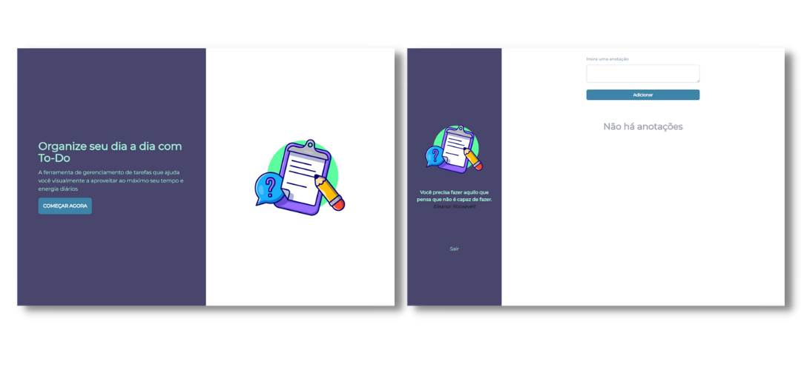

# To Do List - React JS
Projeto criado como um exercício prático durante os estudos em DevLand, visando aprimorar habilidades de desenvolvimento.

## Layout

<div align="center">
  
</div>

## Requisitos

- Aplicar o Clean Code (Obrigatório) ✔️
- React JS ✔️
- Framework de estilo ✔️
- Paginação de dados nas telas de consultas ✔️
- Autorizar TODAS as requisições via token JWT ✔️
- Usar responsividade ✔️
- Permitir que o usuário possa visualizar os dados em modo de card ou Datatable nas telas de consulta ✔️

## Tecnologias

- React JS
- Tailwind CSS

## Back End do projeto
➪ [API To-Do List Node e GraphQL](https://github.com/vanessavargas/todo-node-graphql)

```

project-root/
  ├── public/
  │   └── index.html
  ├── src/
  │   ├── assets/
  │   │   └── images/
  │   │       ├── image.png
  │   │       └── preview.jpg
  │   ├── components/
  │   │   ├── Modal.jsx
  │   │   └── Pagination.jsx
  │   ├── pages/
  │   │   ├── dashboard/
  │   │   │    ├── components/
  │   │   │    │    └── todos/
  │   │   │    │         ├── CreateTodo.jsx
  │   │   │    │         ├── TodoActions.jsx
  │   │   │    │         ├── TodoList.jsx
  │   │   │    │         └── TodoItem.jsx
  │   │   │    └── index.jsx
  │   │   ├── home/
  │   │   │    ├── components/
  │   │   │    │     └── LoginForm.jsx
  │   │   │    └── index.jsx
  │   │   └── RegisterForm.jsx
  │   ├── App.jsx
  │   ├── index.css
  │   ├── index.js
  │   └── routes.js
  ├── package.json         (configurações e dependências do projeto)
  ├── README.md            (documentação do projeto)
  ├── tailwind.config.js   (configurações do Tailwind)
  └── .gitignore           (lista de arquivos a serem ignorados pelo Git)

```

<hr>
<div align="center">
Desenvolvido com ❤️ por VanessaVargas
</div>
